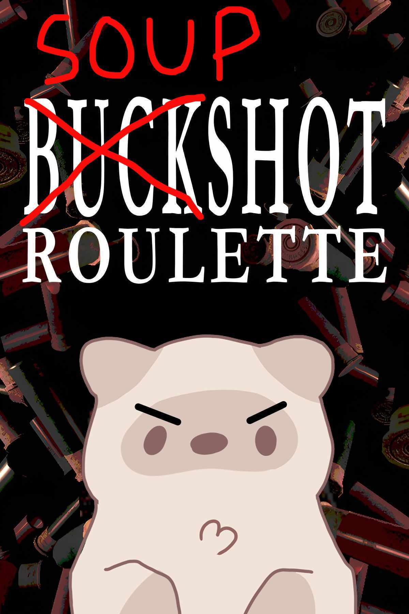

# buckshot-roulette-irl
recreation of the buckshot roulette using a combination of electronics for Fallout in Shenzhen, this ~~lighthearded~~ very serious project makes sense within the competition's lore.

# Context:

The world is ending!!! Resources are scarce and there are too many people (🙁) for shelters.

What is the fairest way to reduce population numbers you may ask? By **gambling**, but more fair kind of mostly I mean technically.

Let's make killing each other a mostly lighthearted game (yay!) by referencing the hit videogame _Buckshot Roulette_.

## Hardware used:

- ESP32-S3 N16R8 acting as the gun connected to the button.
- 2.4" TFT Display (ILI9341, 240x320, spi, landscape).
- Mifrare ultralight NFC stickers (40 units for this project).
- Android smartphones with a chromium-based web browser to interact with NFC.
- Button (for the trigger).

## Game flow 

All players connect to the shotgun (esp32 AP) which is randomized. After connecting, the players will be asked to "sign in" by opening a website and with a camera and be asked to scan the qr code in the shotgun's display. (the first user will be the _admin_ and will be able to set settings like max number of bullets, ratios, etc.). After all players have registered, and the settings are set, the _admin_ will start the game.

If it's the first round, the shotgun will randomly select a player to be the "shooter", if not, the shooter will be the one who's turn should be according to their previous round.
All players get the number of items indicated by each phone, and THEY MUST SCAN THEM to be able to use them (safety measure).
After all users have scanned all their items, the round will start.

The user who is the shooter will be prompted take action by scanning an item or shooting. If they scan an item, it will be deducted from their inventory, and will be used.
Possible actions:
- Adrenaline: select a player who you want to steal from, grab an item from their inventory and scan it. Then use it immediately. (You cannot steal another adrenaline)
- Beer: eject the current shell without shooting it and keep your turn. (you'll be shown the type of shell it was (blank of live))
- Burner Phone: reveal the type/position of a random future shell.
- Cigarette Pack: heal 1 life.
- Hand Saw: next live shot deals 2 damage instead of 1. (cannot be stacked with other hand saws)
- Inverter: flip the current shell: live becomes blank, blank becomes live. (It won't)
- Jammer: choose a player; they skip their next turn.
- Magnifying Glass: reveal the current shell.
- Remote: reverse the turn order.
- Shot: You deal damage to a user if you shoot a live shell. If you shoot a blank shell, you don't make damage. If you shoot yourself with a blank round, you continue playing, any other option will make you pass turn.

When the player uses an item, if needed, the phone of the user who used the item will show an apropiate menu with a message, buttons, or watever, e.g. select target player, or watever.
If an action is something like a magnifying glass (which indicates something about the gun) it will be shown in the gun's display instead of the user's phone.

## Software

The software is divided into two parts: the gun and the web app.
All of the code will run in the esp32-S3, which will act as a web server and will serve the web app to the players. The gun will also handle the game logic, including the randomization of the shells and the management of player turns.
